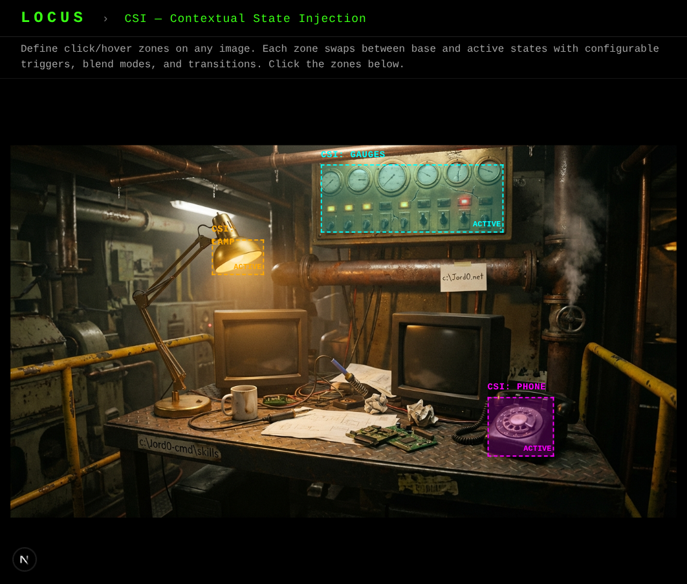
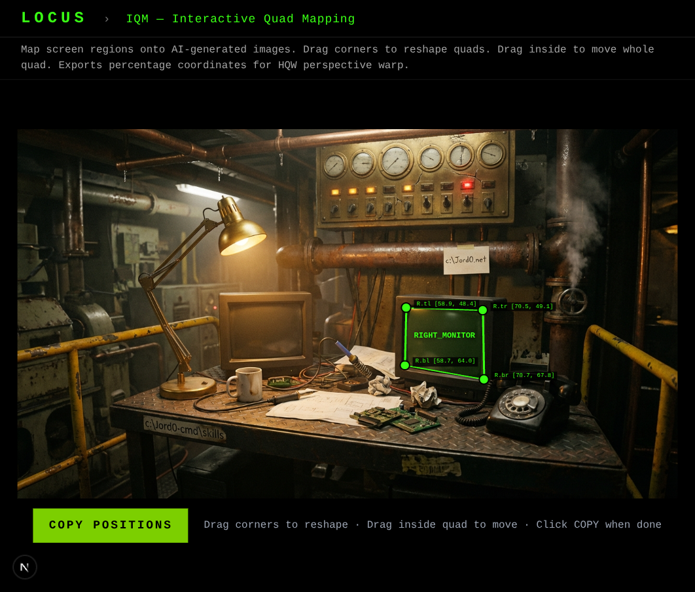
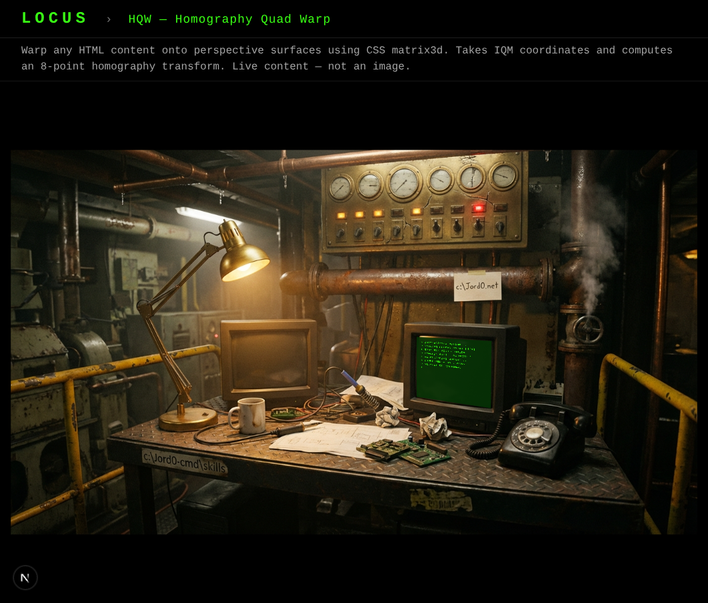
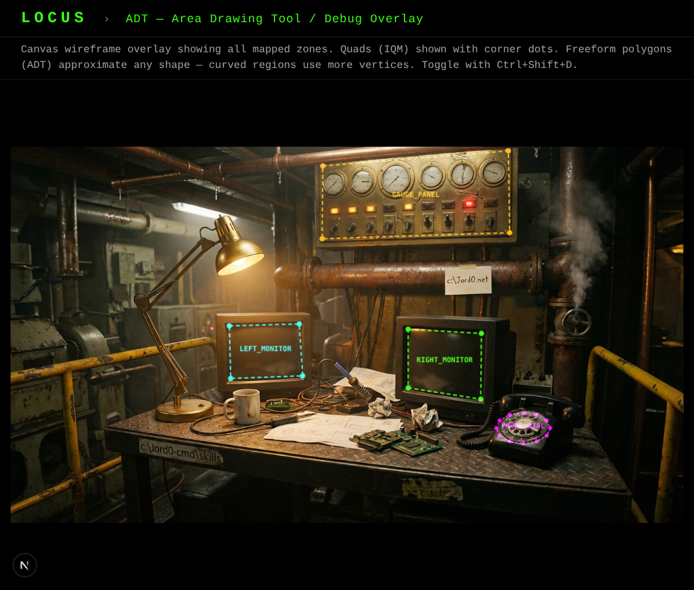

# LOCUS

<span class="tag tag-creative">creative</span>

**Four original techniques for making static images interactive. Hover states, perspective warping, polygon hotspots, and visual coordinate mapping.**

You generated a beautiful AI image. Now what? LOCUS turns it into something people can click, hover, and explore.

---

## The Problem LOCUS Solves

AI image generators produce stunning static images. But static is dead. You want:

- A monitor in the scene that displays live terminal text
- A desk lamp that glows when you hover over it
- Gauges with irregular shapes that respond to clicks
- A before/after comparison slider

Traditional image maps are rectangles on flat images. AI-generated scenes have perspective, distortion, and irregular shapes. CSS `top/left/width/height` can't map content onto a tilted screen. LOCUS can.


*A static AI-generated image. No interactivity. No hover states. LOCUS makes it come alive.*

---

## The Four Techniques

| Technique | Name | What It Does |
|-----------|------|-------------|
| **CSI** | Contextual State Injection | Hover/click/scroll states for image elements |
| **IQM** | Interactive Quad Mapping | Drag-and-drop coordinate tuner |
| **HQW** | Homography Quad Warp | Map rectangular content onto perspective surfaces |
| **ADT** | Area Drawing Tool | Freeform polygon hotspot definition |

They work together: **IQM** maps the quad coordinates → **HQW** warps content onto it → **CSI** generates hover states → **ADT** handles irregular shapes.

---

## How It Works — The Human-in-the-Loop

LOCUS is collaborative. Claude builds the pages and components. **You** do the visual work in the browser.

```
1. You describe what you want ("overlay text on that monitor")
2. Claude builds a tuner page and starts a dev server
3. You open the browser and drag corners / draw shapes
4. You copy the coordinates and paste them back
5. Claude wires them into the production code
6. You review — adjust if needed
7. Done
```

**Your eyes are the instrument.** AI-generated images have unique distortions that code can't predict. The tuner tools exist so you can look at it and drag it until it's right.

---

## CSI — Contextual State Injection

Make elements in AI images respond to interaction.

**The idea**: Crop an element (a lamp, a monitor, a gauge), feed it back to an AI image generator as a reference with instructions for the new state ("the lamp is now glowing bright amber"), and overlay the result at the original position.

| What You Start With | What CSI Produces |
|--------------------|--------------------|
| A dark desk lamp | Lamp glowing warm amber on hover |
| A blank monitor | Monitor showing green terminal text on click |
| A pressure gauge | Gauge needle at different positions per state |

```
Hover over the lamp → warm glow fades in
Click the monitor → boot sequence appears
Scroll past the gauge → needle sweeps from 0 to maximum
```

CSI also has an **Analogue Fork** — CSS-only state changes (brightness, hue-rotate, drop-shadow) for when you don't have access to an AI image generator.


*CSI in action — the gauge panel and rotary phone both have active hover zones with state overlays.*

---

## IQM — Interactive Quad Mapping

The visual coordinate tuner. Instead of guessing pixel positions, drag corners on the image.


*IQM in action — drag the green corners to map the RIGHT_MONITOR quad. Click COPY POSITIONS when it looks right.*

**Before IQM**: Guess percentages, screenshot, compare, nudge, repeat. 4-5 rounds of trial and error.

**With IQM**: Open the tuner, drag four corners to match the screen edges, click COPY POSITIONS. Done in 30 seconds.

The DebugTuner supports:

- **Multiple named quads** with distinct colours
- **Corner dragging** to reshape individual vertices
- **Whole-quad dragging** to move all four corners together
- **One-click copy** of all positions as JSON

---

## HQW — Homography Quad Warp

Map rectangular content (HTML, text, video) onto any perspective surface using CSS `matrix3d()`.

That monitor in your AI image isn't a perfect rectangle — it's perspective-distorted, slightly tilted, maybe barrel-distorted. HQW computes the exact 4x4 transformation matrix that warps a flat rectangle to match those four corners.

```
Your HTML terminal text  →  matrix3d() transform  →  Perfectly mapped onto the tilted screen
```

The math is 47 lines of linear algebra. You never touch it — you just drag corners in IQM and paste the coordinates.


*HQW warping live terminal text onto a perspective CRT monitor. The content is real HTML, not an image.*

---

## ADT — Area Drawing Tool

Define irregular clickable regions by drawing polygons directly on the image.

Not everything is a rectangle. Gauges are circular. Smoke wisps are organic. Whisky glasses are... whisky-glass-shaped. ADT lets you draw freeform polygon boundaries with:

- **Click to place vertices** on the image
- **Douglas-Peucker simplification** to smooth rough drawings
- **Point-in-polygon hit testing** for click/hover detection
- **Multiple named regions** with distinct colours

The polygons export as percentage-based vertex arrays — responsive at any size.


*ADT debug wireframe showing all mapped zones — IQM quads (LEFT_MONITOR, RIGHT_MONITOR) and freeform polygons with labelled centres. Toggle with Ctrl+Shift+D.*

---

## CompareSlider — Before/After Ghost Mode

Drag a slider to compare two versions of the same image.


*Ghost Mode — drag the slider to compare original and edited versions. Keyboard accessible with arrow keys.*

Use it for:

- Before/after editing comparisons
- State change demonstrations
- A/B visual testing
- Portfolio showcases

---

## When to Use Each Technique

| You Want To... | Use |
|---------------|-----|
| Add hover glow to a lamp | **CSI** |
| Put live text on a tilted screen | **IQM** → **HQW** |
| Make an irregular gauge clickable | **ADT** |
| Show before/after versions | **CompareSlider** |
| Position a rectangular overlay | **IQM** (the DebugTuner is for rectangles too) |
| Create a full interactive scene | **All four** together |

---

## Advanced Tips

### Combine techniques on one scene

A single image can have:

- 3 HQW-warped terminals showing different content
- 5 CSI zones with hover effects
- 2 ADT polygons for irregular shapes
- 1 CompareSlider for before/after

All techniques use percentage-based coordinates — they're responsive and work at any viewport size.

### The aspect-ratio container pattern

!!! danger "Don't use object-contain for CSI overlays"
    `object-fit: contain` creates a gap between the container and the rendered image. CSS absolute positions will be offset. Instead, wrap the image in a container with a matching `aspect-ratio` — the container IS the image bounds.

### Security

LOCUS involves DOM injection and coordinate transforms. The skill includes DOMPurify sanitization for all overlay content, numeric validation for coordinates, and safe `JSON.parse()` patterns. Full security checklist included.

---

## Pairs With OPTIC

OPTIC generates the images. LOCUS makes them interactive. See the [Creative Pipeline](../recipes/creative-pipeline.md) recipe for the full workflow.

---

## Prerequisites

- React 18+ environment (Next.js, Vite, Remix, or standalone)
- `dompurify` package for DOM sanitization
- A running dev server (the tuner tools run in the browser)
- No other external dependencies

---

*Four techniques. One toolkit. Static images, made alive.*
